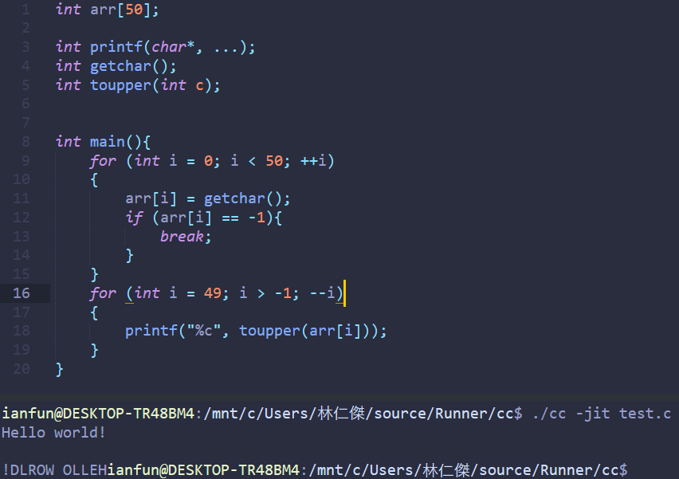
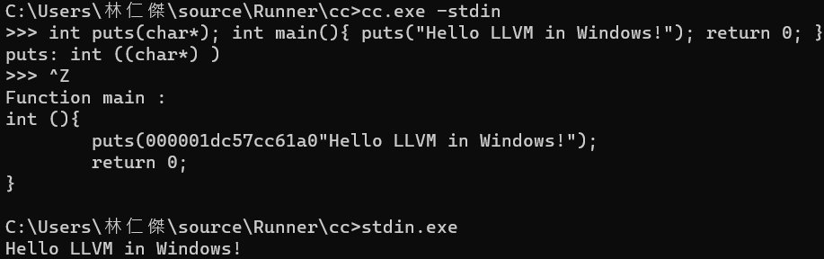

# cc





C Compiler written in [Nim](https://nim-lang.org/)

## About

CC is a C preprocessor、frontend, can compile C to LLVM IR(like clang)

CC is tested in Windows 64 bit/WSL Ubuntu, with LLVM-15 installed and use GNU ld linker

## Steps of process

1. source file(file or string stream, defined in *stream.nim*) => lexical tokens *lexer.nim* => C-Preprocess(CPP)*lexer.nim* => parsing, type checking
2. generate LLVM IR using LLVM-C API
3. write LLVM code to file

## Install

* install LLVM 15 
  - [Debian/Ubuntu](https://apt.llvm.org/)
  - [Windows](https://github.com/llvm/llvm-project/releases)
* install a C++ compiler(g++, clang)
* use `llvm-config` to get install libary path, and build

## Build

build C++ API helper file

```bash
g++ -x c `llvm-config --cflags` `llvm-config --ldflags --libs all --system-libs` llvmAPI.c -c -o llvmAPI
```

cc is main program of compiler

```bash
$ nim c cc # nim c cc.nim
$ ./cc # input files
```

documentation generated by

```bash
nim doc --project --index:on --git.url:https://github.com/ianfun/cc --git.commit:master cc.nim
```

# Usage

in Windows Terminal or some terminal

help

```bash
$ ./cc -help
```

compile file to object file(default)

```bash
$ ./cc test.c # write to test.c.out
```

set output file path

```bash
$ ./cc test.c -o test # write to test.out/test.exe
```

output LLVM Assembly

```bash
$ ./cc -emit-llvm test.c # write to test.ll
```
output GNU Assembly(GAS)

```bash
$ ./cc -s test.c # write to test.c.s
```

output LLVM bitcode

```bash
$ ./cc -emit-bitcode test.c # write to test.c.bc
```

set GNU linker(ld)

```bash
$ ./cc test.c -ld
```

set LLVM linker(ld.lld)

there are some issues in lld now(maybe missing C runtime libary?)

```bash
$ ./cc test.c -lld
ld.lld: error: undefined symbol: puts                                                                                         
>>> referenced by main                                                                                                        
>>>               test.c.out.o:(main)                                                                                         
>>> referenced by main                                                                                                        
>>>               test.c.out.o:(main)                                                                                         
                                                                                                                              
ld.lld: error: undefined symbol: system                                                                                       
>>> referenced by main                                                                                                        
>>>               test.c.out.o:(main)                                                                                         
cc: error: error: ld.lld returned 256 exit status
```

run in JIT(Just-In-Time Compilation)

```bash
$ ./cc -jit test.c
run program in JIT...
```

## Cross Compiling in cc

you can use `-target` command line option to cross compiling C program to a specific machine

pass `-c` flag will not run linker

for example, in WSL or Linux bash:

```bash
$ ./cc test.c -target x86_64-pc-windows-msvc -c # cross compiling from x86_64-pc-linux-gnu to x86_64-pc-windows-msvc
$ /mnt/c/xxx/gcc.exe test.c.o # compile in windows gcc
$ ./a.exe # run!
$ ./cc test.c -target x86_64-pc-linux-gnu -c # cross compiling from xxx target to to x86_64-pc-linux-gnu
$ ./a.out
```

## LLVM API

Build in **LLVM 15**, C-API

other version will to compile because cc use [Opaque Pointers](https://llvm.org/docs/OpaquePointers.html) API.

for example, `LLVMpointerTypeInContext()`, `LLVMBuildLoad2()`, `LLVMConstInBoundsGEP2()`, `LLVMBuildCall2()` are used in cc.

However, you can disable opaque Pointer in command line options.(use `LLVMContextSetOpaquePointers()` to disable)

## JIT

cc use LLVM JIT, by default, `main(argc, argv)` cc will call this function as program startup .

## Contribute

contribute by pull requests is wellcome

## References

ISO book: *Programming languages — C*
