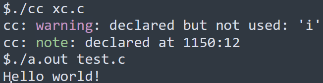

# cc

C language Compiler, Frontend!

## About

CC is a C language Preprocessor、Frontend, can compile C to LLVM

CC is tested in Windows 64 bit/WSL Ubuntu, with LLVM-15 installed and use GNU ld linker

cc is now can compile [xc.c](https://github.com/lotabout/write-a-C-interpreter), a C small interpreter!



cc provides stack trace backs in the `-libtrace` command line option, if the program try to access `NULL` or some signal was recieved, or array index out of bounds, it will print stack trace to stderr


libtrace provides some runtime checks

* signal handling
* call limits in function
* array index checker
* division by zero checker
* derefence from `NULL`

for example the C program

```C
int getchar(void);

int foo(int n){
	int arr[10];
	return arr[n];
}

int main(){
	foo(getchar());
}
```

will raise errors when index is >= 10


## Steps of process

1. source file(file or string stream, defined in *stream.nim*) => lexical tokens *lexer.nim* => C-Preprocess(CPP)*lexer.nim* => parsing, type checking
2. generate LLVM IR using LLVM-C API
3. write LLVM code to file

## Install

install LLVM

### Debian/Ubuntu

run [llvm.sh](https://apt.llvm.org/) to install shared libary(libLLVM-15.so)

```bash
$ sudo ./llvm.sh 15 all # install LLVM-15
```

test in Ubuntu 20.04.4 LTS

### Windows

It is recommaned to use MSYS pre-builed binarys to install LLVM, it is not require MSVC.

First, install MSYS2, open MSYS shell

```bash
$ pacman -Syu
```

after update complete and shell closed, reopen a MSYS shell

```bash
$ pacman -Sy
$ pacman -S mingw-w64-x86_64-llvm # install LLVM
$ pacman -S mingw-w64-x86_64-clang # install clang and linker
```

add clang++ to your PATH, and use `llvm-config` to find LLVM binary libary path, use for linking cc

now the installation is complete!

## Build

use git to clone the source

First, build C++ API helper file

```bash
$ g++ `llvm-config --cxxflags` llvmAPI.cpp -c -o llvmAPI.o -O3 # Linux
$ clang++ -I<llvm-include-path> -std=c++14 -fno-exceptions -fno-rtti -D_FILE_OFFSET_BITS=64 -D__STDC_CONSTANT_MACROS -D__STDC_FORMAT_MACROS llvmAPI.cpp -c -o llvmAPI.o -O3 # Windows
```

Build with Nim

```bash
$ cd cc
$ nim c cc # Debug build
$ nim -d:release cc # Release build
$ nim c -d:CC_NO_RAEADLINE cc # if you don't have GNU Readline
```

# Usage

in Windows Terminal or some terminal

help

```bash
$ ./cc --help
```

compile file to object file(default)

```bash
$ ./cc test.c # wrote to test.c.out
```

set output file path

```bash
$ ./cc test.c -o test # wrote to test.out/test.exe
```

output LLVM Assembly

```bash
$ ./cc -emit-llvm test.c # write to test.ll
```
output GNU Assembly(GAS)

```bash
$ ./cc -s test.c # wrote to test.c.s
```

output LLVM bitcode

```bash
$ ./cc -emit-bitcode test.c # wrote to test.c.bc
```

set GNU linker(ld)

```bash
$ ./cc test.c -ld
```

set LLVM linker(ld.lld)

there are some issues in lld now(maybe missing C runtime libary?)

```bash
$ ./cc test.c -lld
ld.lld: error: undefined symbol: puts                                                                                         
>>> referenced by main                                                                                                        
>>>               test.c.out.o:(main)                                                                                         
>>> referenced by main                                                                                                        
>>>               test.c.out.o:(main)                                                                                         
                                                                                                                              
ld.lld: error: undefined symbol: system                                                                                       
>>> referenced by main                                                                                                        
>>>               test.c.out.o:(main)                                                                                         
cc: error: error: ld.lld returned 256 exit status
```

run in JIT(Just-In-Time Compilation)

```bash
$ ./cc -jit test.c
run program in JIT...
```

## Cross Compiling in cc

you can use `-target` command line option to cross compiling C program to a specific machine

pass `-c` flag will not run linker

for example, in WSL or Linux bash:

```bash
$ ./cc test.c -target x86_64-pc-windows-msvc -c # cross compiling from x86_64-pc-linux-gnu to x86_64-pc-windows-msvc
$ /mnt/c/xxx/gcc.exe test.c.o # compile in windows gcc
$ ./a.exe # run!
$ ./cc test.c -target x86_64-pc-linux-gnu -c # cross compiling from xxx target to to x86_64-pc-linux-gnu
$ ./a.out
```

## LLVM API

Build in **LLVM 15**, C-API

other version will to compile because cc use [Opaque Pointers](https://llvm.org/docs/OpaquePointers.html) API.

for example, `LLVMpointerTypeInContext()`, `LLVMBuildLoad2()`, `LLVMConstInBoundsGEP2()`, `LLVMBuildCall2()` are used in cc.

However, you can disable opaque Pointer in command line options.(use `LLVMContextSetOpaquePointers()` to disable)

## GNU Readline

cc use GNU Readline library by default for reading from stdin

define `CC_NO_RAEADLINE` to disable use GNU readlines

## JIT

cc use LLVM JIT, by default, `main(argc, argv)` cc will call this function as program startup .

## Features Supported

* VLA
* `__asm__` strings

## Contribute

contribute by pull requests is wellcome

## References

ISO book: *Programming languages — C*
